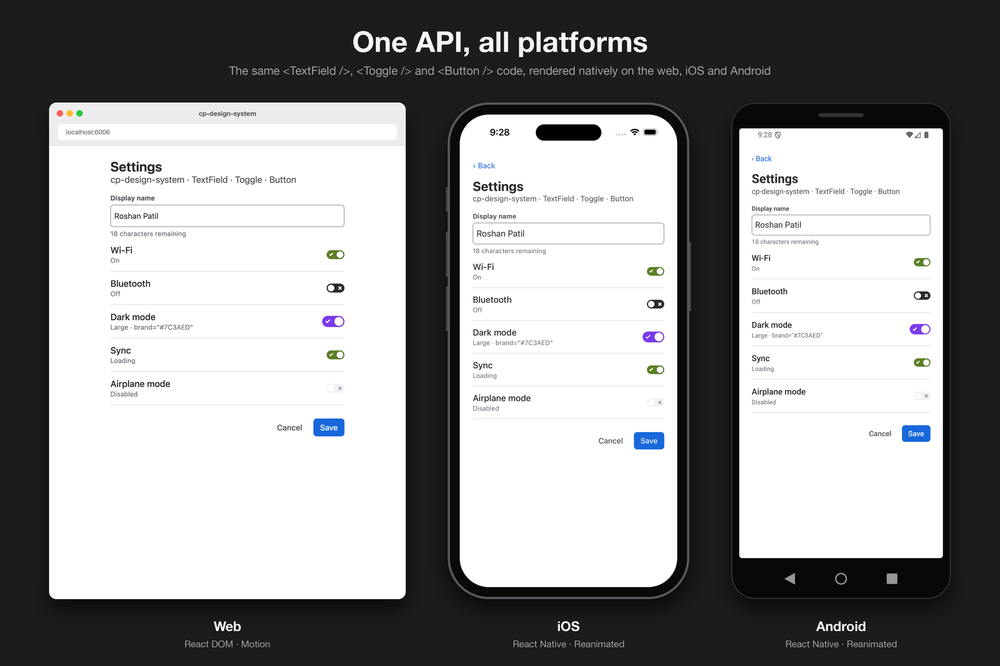

# cp-design-system

Animated, brand-themable design system for React (web) and React Native, built on Atlassian's design tokens. Published to npm as [`cp-design-system`](https://www.npmjs.com/package/cp-design-system). Package docs: [packages/cp-design-system/README.md](packages/cp-design-system/README.md).

## One API, all platforms



The same `<TextField />`, `<Toggle />` and `<Button />` from `cp-design-system`, rendered natively on each platform: the DOM with Motion on the web, and native views with Reanimated and Gesture Handler on iOS and Android. The screen is `apps/storybook/stories/Showcase.stories.tsx` on the web and `apps/expo-example/Showcase.tsx` on mobile. To regenerate the image, see [docs/showcase](docs/showcase/README.md).

## How it works

**Tokens.** `yarn workspace cp-design-system sync-tokens` reads Atlassian's raw tokens from `@atlaskit/tokens` (a pinned dev dependency) and writes typed files to `src/tokens/atlassian/*.generated.ts`. Those files are committed, so the published package doesn't depend on Atlaskit. CI fails if they drift from the pinned version.

**Theme.** `createTheme()` in `src/theme/` layers brand ramps (OKLCH, matched to Atlassian's Blue lightness curve), contrast fixes and user overrides on top of the tokens. `ThemeProvider` adds the color mode, the reduced-motion setting and haptics.

**Components.** Each component has shared logic and two thin renderers:

```
src/components/Toggle/
├─ Toggle.types.ts     # props, identical on both platforms
├─ Toggle.tokens.ts    # default style tokens, derived from the theme
├─ useToggle.ts        # shared state (controlled / uncontrolled)
├─ Toggle.web.tsx      # DOM + Motion
└─ Toggle.native.tsx   # React Native + Reanimated + Gesture Handler
```

`src/index.web.ts` and `src/index.native.ts` export the matching renderers. tsup builds them to `dist/web` and `dist/native`. The `exports` map in `package.json` sends Metro to the native build (`react-native` condition) and every other bundler to the web build. The web build never imports `react-native` or Reanimated, and the native build never imports Motion.

## Repo layout

| Path                        | What                                                               |
| --------------------------- | ------------------------------------------------------------------ |
| `packages/cp-design-system` | The published package                                              |
| `apps/storybook`            | Storybook (web). Reads package **source**, so edits hot-reload     |
| `apps/expo-example`         | Expo app. Uses the **built** package, exactly like a real consumer |

## Development

```bash
yarn install
yarn storybook          # web playground at http://localhost:6006
yarn dev                # rebuild the package on change (needed for the Expo app)
yarn example            # start the Expo app (press i for iOS simulator)
yarn test               # Vitest (web) + Jest (native)
yarn typecheck && yarn lint
```

### Adding a component

Components land one per pull request, each fully tested on both platforms.

1. Create `src/components/Foo/` following the layout above. Read colors, spacing and springs from `useTheme()`, and merge customizations with `resolveTokens()` and `resolveSpring()` from `src/theme/component.ts`.
2. Add `Foo?: ComponentTheme<FooProps, FooTokens>` to `ComponentThemes` in `src/theme/types.ts`.
3. Export the renderer from `index.web.ts` and `index.native.ts`, and its types from `shared.ts`.
4. Add `Foo.web.test.tsx` and `Foo.native.test.tsx`, a story in `apps/storybook/stories`, and a screen in the Expo example.

## Publishing

npm, yarn, pnpm and bun all install from the **npm registry**, so publishing once to npm covers all of them.

Releases are automatic. The Release workflow runs on every push to `main` and publishes the package **only when its version isn't on npm yet**. No npm token is stored anywhere: GitHub Actions authenticates through npm [trusted publishing](https://docs.npmjs.com/trusted-publishers).

**To release a change:**

1. In your branch, bump the version from `packages/cp-design-system`:
   ```bash
   npm version patch --no-git-tag-version   # or minor / major
   ```
2. Commit the `package.json` change with your PR and merge it to `main`.
3. The workflow runs typecheck, tests and the build, publishes to npm, and tags the commit `vX.Y.Z`.

Merges that don't change the version publish nothing.

**Use patch** for fixes (0.1.2 → 0.1.3), **minor** for new components or props (0.1.2 → 0.2.0) and **major** for breaking changes (0.1.2 → 1.0.0).

> Never run `yarn add cp-design-system` or `npm install cp-design-system` inside this repo. The apps already use the local package, and installing it into itself creates a self-dependency.
